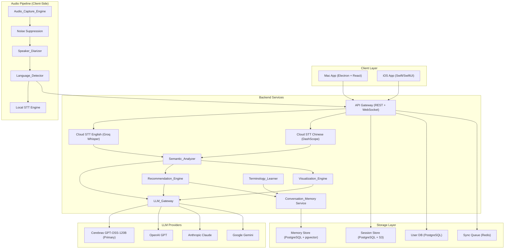
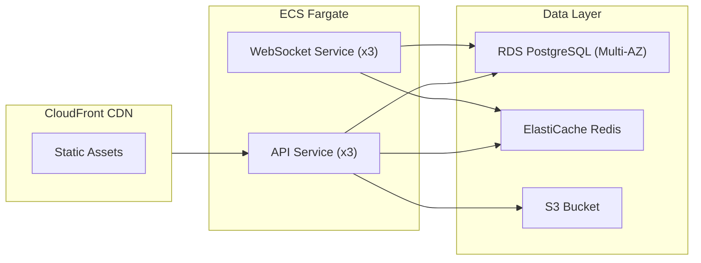
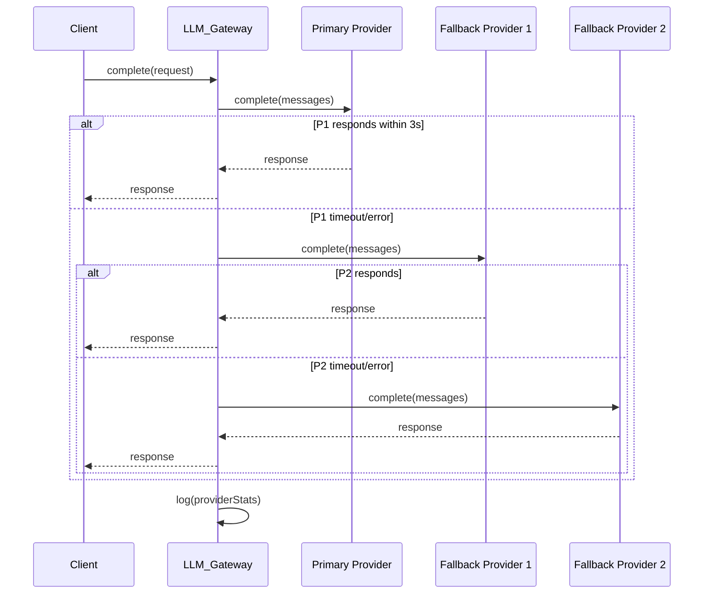
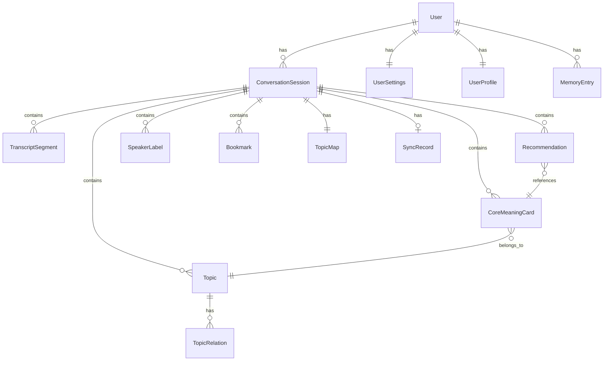

# Design Document — "What Do You Mean" (啥意思)

## Overview

"What Do You Mean" (啥意思) is a real-time conversation understanding tool that captures live audio (or accepts pasted text), transcribes speech, extracts core meaning via LLMs, and presents results as concise visual cards with intelligent follow-up recommendations.

The system is built around a streaming pipeline:

```
Audio/Text Input → Adaptive STT → LLM Semantic Analysis → Visualization + Recommendations
```

It ships as an Electron Mac App and a Native iOS App (Swift/SwiftUI), sharing a common backend. The Electron app uses React for the UI and can access macOS system audio via ScreenCaptureKit/CoreAudio for seamless meeting capture. The LLM layer is provider-agnostic via a unified `LLM_Gateway` that abstracts Cerebras GPT-OSS-120B (primary), GPT, Claude, and Gemini behind a single interface with automatic fallback and streaming support.

Key architectural drivers:
- **Real-time latency**: The entire pipeline from speech to on-screen card must complete within ~6 seconds (1s STT + 3s semantic + 2s recommendation).
- **Adaptive STT**: Seamless switching between local on-device and cloud STT based on network conditions.
- **Conversation Memory**: Per-user persistent memory that personalizes recommendations over time.
- **Privacy-first**: Audio buffers are ephemeral, all stored data is encrypted, and a "Local Processing Only" mode is available.
- **Bilingual**: Chinese + English with code-switching support, architected for future language expansion.

## Architecture

### High-Level System Architecture



### Technology Stack

| Layer | Technology | Rationale |
|-------|-----------|-----------|
| Mac Desktop | Electron 33 + React 18 | Native system audio capture via ScreenCaptureKit, shares React UI with potential web deployment, mature ecosystem |
| iOS Frontend | Swift 5.9 + SwiftUI | Native performance for audio capture, background processing, and smooth UI |
| Backend API | Node.js (TypeScript) + Fastify | Low-latency WebSocket support, TypeScript shared types with frontend |
| Real-time Transport | WebSocket (Socket.IO) | Bidirectional streaming for live transcription and card updates |
| Database | PostgreSQL 16 + pgvector | Relational data + vector embeddings for Conversation_Memory semantic search |
| Object Storage | S3-compatible (AWS S3) | Session archive blobs, exported Markdown files |
| Cache / Queue | Redis 7 | Sync queue, session state cache, rate limiting |
| Local STT (Mac) | Whisper.cpp / macOS Speech Recognition | On-device transcription for offline/low-latency fallback on Mac |
| Local STT (iOS) | Apple Speech Framework | Native on-device STT with Chinese + English support |
| Cloud STT (English) | Groq Whisper Large v3 Turbo | $0.04/hr, 216x real-time speed, 0.5s latency, OpenAI-compatible API |
| Cloud STT (Chinese) | Alibaba DashScope Qwen ASR | Best-in-class Chinese and dialect accuracy |
| LLM Providers | Cerebras GPT-OSS-120B (primary), OpenAI GPT-4o, Anthropic Claude, Google Gemini | Cerebras: 2,224 t/s output speed, free tier 1M tokens/day, Apache 2.0 open-source; others as fallback for redundancy |
| Auth | Guest mode (no login required) + JWT + OAuth 2.0 (Apple Sign-In, Google) | Core features work without auth; sign-in unlocks history, sync, memory, export |
| Deployment | AWS (ECS Fargate + CloudFront + RDS) | Managed infrastructure, global CDN for web app |
| CI/CD | GitHub Actions | Automated build, test, deploy pipeline |

### Deployment Architecture



## Components and Interfaces

### 1. Audio_Capture_Engine

Runs entirely on the client. On Mac (Electron), captures system audio via macOS ScreenCaptureKit/CoreAudio and microphone input simultaneously. On iOS, captures microphone audio. Applies noise suppression and streams audio chunks to the Transcription_Engine.

```typescript
interface AudioCaptureEngine {
  // Lifecycle
  startCapture(config: CaptureConfig): Promise<void>;
  pauseCapture(): void;
  resumeCapture(): void;
  stopCapture(): Promise<CaptureResult>;

  // Configuration
  setAudioSource(source: AudioSource): Promise<void>;
  getAvailableDevices(): Promise<AudioDevice[]>;

  // Events
  onAudioChunk: (chunk: AudioChunk) => void;
  onSourceUnavailable: (error: AudioSourceError) => void;
  onNoiseWarning: (level: number) => void;
}

interface CaptureConfig {
  mode: 'online' | 'offline';
  sampleRate: 16000 | 44100;
  channels: 1 | 2; // mono for offline, stereo for online (system + mic)
  noiseSuppression: boolean;
  autoGain: boolean;
}

interface AudioChunk {
  data: Float32Array;
  timestamp: number;
  channel: 'system' | 'microphone' | 'mixed';
  durationMs: number;
}
```

### 2. Transcription_Engine (Adaptive, Language-Routed STT)

Manages adaptive switching between local and cloud STT providers. Cloud STT is language-routed: English audio goes to Groq Whisper Large v3 Turbo (216x real-time, 0.5s latency, OpenAI-compatible API), Chinese audio goes to Alibaba DashScope Qwen ASR (best Chinese/dialect accuracy). Local fallback uses Apple Speech Framework (iOS) or Web Speech API / Whisper.js WASM (web).

```typescript
interface TranscriptionEngine {
  startTranscription(sessionId: string, languageCode: string): void;
  stopTranscription(): void;
  feedAudio(chunk: AudioChunk): void;

  // Events
  onInterimResult: (result: TranscriptSegment) => void;
  onFinalResult: (result: TranscriptSegment) => void;
  onProviderSwitch: (from: STTProvider, to: STTProvider) => void;
}

interface STTProvider {
  name: string; // 'groq_whisper' | 'dashscope_qwen' | 'apple_speech' | 'web_speech' | 'whisper_wasm'
  type: 'local' | 'cloud';
  supportedLanguages: ('zh' | 'en')[];
  startStream(languageCode: string): void;
  feedAudio(chunk: AudioChunk): void;
  stopStream(): void;
  onResult: (result: TranscriptSegment) => void;
}

interface TranscriptSegment {
  id: string;
  text: string;
  languageCode: 'zh' | 'en';
  speakerId: string;
  startTime: number;
  endTime: number;
  isFinal: boolean;
  confidence: number;
  provider: string; // which STT provider produced this
}

interface AdaptiveSTTConfig {
  cloudLatencyThresholdMs: 500;
  switchBackDelayMs: 5000; // debounce before switching back to cloud
  preferCloud: boolean; // user preference
  cloudProviderRouting: {
    'en': 'groq_whisper';   // English → Groq Whisper
    'zh': 'dashscope_qwen'; // Chinese → DashScope Qwen ASR
  };
}
```

### 3. Language_Detector

Pluggable language detection module. Runs on the client for audio, on the server for text input.

```typescript
interface LanguageDetector {
  detectFromAudio(audioChunk: AudioChunk): Promise<LanguageDetectionResult>;
  detectFromText(text: string): LanguageDetectionResult;
  onLanguageChange: (result: LanguageDetectionResult) => void;
}

interface LanguageDetectionResult {
  primaryLanguage: 'zh' | 'en';
  confidence: number;
  isCodeSwitching: boolean;
}
```

### 4. Speaker_Diarizer

Identifies and labels distinct speakers within a session.

```typescript
interface SpeakerDiarizer {
  initialize(sessionId: string): void;
  processAudio(chunk: AudioChunk): SpeakerSegment;
  assignName(speakerId: string, name: string): void;

  onSpeakerChange: (segment: SpeakerSegment) => void;
}

interface SpeakerSegment {
  speakerId: string;
  displayName: string | null;
  startTime: number;
  endTime: number;
  confidence: number; // < 0.7 = "uncertain attribution"
}
```

### 5. LLM_Gateway

The central abstraction for all LLM interactions. Cerebras GPT-OSS-120B is the primary provider (2,224 tokens/sec output, free tier 1M tokens/day, Apache 2.0 open-source, intelligence on par with Gemini 2.5 Flash and Claude Opus 4). OpenAI GPT, Anthropic Claude, and Google Gemini serve as fallback providers. Supports automatic fallback, streaming, and performance tracking.

```typescript
interface LLMGateway {
  // Core inference
  complete(request: LLMRequest): Promise<LLMResponse>;
  stream(request: LLMRequest): AsyncIterable<LLMStreamChunk>;

  // Provider management
  registerProvider(provider: LLMProviderAdapter): void;
  setPreferredProvider(providerId: string): void;
  getProviderStats(): ProviderStats[];
}

interface LLMRequest {
  taskType: 'semantic_analysis' | 'recommendation' | 'visualization_detection' | 'topic_extraction';
  messages: LLMMessage[];
  maxTokens: number;
  temperature: number;
  stream: boolean;
  timeoutMs: number; // default 3000
}

interface LLMProviderAdapter {
  id: string; // 'cerebras' | 'openai' | 'anthropic' | 'google'
  name: string;
  complete(messages: LLMMessage[], options: LLMOptions): Promise<LLMResponse>;
  stream(messages: LLMMessage[], options: LLMOptions): AsyncIterable<LLMStreamChunk>;
  isAvailable(): Promise<boolean>;
}

interface ProviderStats {
  providerId: string;
  avgResponseTimeMs: number;
  errorRate: number; // 0.0 - 1.0
  totalRequests: number;
  lastErrorTimestamp: number | null;
}

// Fallback logic (pseudocode):
// 1. Try preferred provider
// 2. If timeout (3s) or error → try next provider in priority order
// 3. Log failure + response time
// 4. Return first successful response
```

**Fallback Strategy:**



### 6. Semantic_Analyzer

Processes finalized transcript segments through the LLM_Gateway to extract core meaning, categorize it, and detect relationships between meaning cards.

```typescript
interface SemanticAnalyzer {
  analyze(segment: TranscriptSegment, sessionContext: SessionContext): Promise<CoreMeaningCard>;
  updateTopicMap(card: CoreMeaningCard): Promise<TopicMap>;
  detectDuplicate(card: CoreMeaningCard, existingCards: CoreMeaningCard[]): Promise<MergeDecision>;
}

interface SessionContext {
  sessionId: string;
  recentTranscripts: TranscriptSegment[]; // last N segments for context
  existingCards: CoreMeaningCard[];
  topicMap: TopicMap;
  memoryContext: MemoryContext | null; // from Conversation_Memory
}

type MeaningCategory = 
  | 'factual_statement'   // 事实陈述
  | 'opinion'             // 观点
  | 'question'            // 问题
  | 'decision'            // 决定
  | 'action_item'         // 待办事项
  | 'disagreement';       // 分歧

interface MergeDecision {
  shouldMerge: boolean;
  targetCardId: string | null;
  mergedContent: string | null;
}
```

### 7. Recommendation_Engine

Generates contextual conversation recommendations, informed by both the current session and Conversation_Memory.

```typescript
interface RecommendationEngine {
  generateRecommendations(
    card: CoreMeaningCard,
    sessionContext: SessionContext,
    memoryContext: MemoryContext | null
  ): Promise<Recommendation[]>;
}

type RecommendationType =
  | 'follow_up_question'    // 追问
  | 'clarification'         // 澄清
  | 'new_proposal'          // 新提议
  | 'challenge'             // 质疑/反驳
  | 'summary_confirmation'  // 总结确认
  | 'topic_pivot';          // 话题转换

interface Recommendation {
  id: string;
  type: RecommendationType;
  text: string;
  reasoning: string; // why this recommendation was generated
  sourceCardId: string;
  memoryReferenceIds: string[]; // IDs of memory entries that informed this
}
```

### 8. Visualization_Engine

Selects the optimal presentation format for each Core_Meaning_Card and renders it.

```typescript
interface VisualizationEngine {
  selectFormat(card: CoreMeaningCard): Promise<VisualizationFormat>;
  renderCard(card: CoreMeaningCard, format: VisualizationFormat): RenderOutput;
  renderTopicMap(topicMap: TopicMap): RenderOutput;
}

type VisualizationFormat = 'concise_text' | 'flow_diagram';

interface RenderOutput {
  type: VisualizationFormat;
  html: string; // rendered HTML for web
  data: object; // structured data for native rendering
}
```

### 9. Conversation_Memory Service

Manages per-user persistent memory: extraction, storage, retrieval, and deletion.

```typescript
interface ConversationMemoryService {
  // Extraction (called when session ends)
  extractMemory(session: SessionArchive): Promise<MemoryEntry[]>;

  // Retrieval (called when session starts or recommendations are generated)
  queryMemory(userId: string, context: MemoryQuery): Promise<MemoryContext>;

  // Management
  deleteEntry(userId: string, entryId: string): Promise<void>;
  clearAllMemory(userId: string): Promise<void>;
  getUserProfile(userId: string): Promise<UserProfile>;
}

interface MemoryQuery {
  speakerIds?: string[];
  topics?: string[];
  limit: number;
  includeUnresolved: boolean; // unresolved questions, pending action items
}

interface MemoryContext {
  relevantEntries: MemoryEntry[];
  unresolvedQuestions: MemoryEntry[];
  pendingActionItems: MemoryEntry[];
  recurringTopics: string[];
}
```

### 10. Terminology_Learner

Inspired by the Typeless replacement approach: a multi-stage post-processing system that automatically learns domain-specific terminology by comparing raw ASR output with LLM-refined text. Improves transcription accuracy over time.

```typescript
interface TerminologyLearner {
  // Post-processing pipeline
  postProcess(rawText: string, refinedText: string): PostProcessResult;

  // Dictionary management
  getDictionary(userId: string): Promise<TermEntry[]>;
  addTerm(userId: string, term: TermEntry): Promise<void>;
  removeTerm(userId: string, termId: string): Promise<void>;

  // Auto-learning (called after LLM refinement)
  learnFromDiff(rawASROutput: string, llmRefinedOutput: string): Promise<TermEntry[]>;
}

interface PostProcessResult {
  correctedText: string;
  appliedCorrections: Correction[];
}

interface Correction {
  original: string;
  corrected: string;
  rule: 'acronym_folding' | 'token_merge' | 'entity_correction' | 'case_normalization' | 'dictionary_match';
}

interface TermEntry {
  id: string;
  userId: string;
  term: string;           // the correct form (e.g., "API", "PostgreSQL")
  variants: string[];     // ASR misrecognitions (e.g., ["a p i", "A.P.I.", "api"])
  frequency: number;      // how often this term appears
  source: 'auto_learned' | 'user_added';
  createdAt: Date;
}
```

### 11. Session_Archive Service

Handles session persistence, search, sync, and export.

```typescript
interface SessionArchiveService {
  saveSession(session: SessionArchive): Promise<void>;
  getSession(sessionId: string): Promise<SessionArchive>;
  listSessions(userId: string, options: ListOptions): Promise<SessionSummary[]>;
  searchSessions(userId: string, keyword: string): Promise<SessionSummary[]>;
  deleteSession(sessionId: string): Promise<void>;
  exportSession(sessionId: string, format: 'markdown'): Promise<string>;

  // Sync
  syncToCloud(sessionId: string): Promise<void>;
  syncFromCloud(userId: string): Promise<SessionSummary[]>;
  resolveConflict(sessionId: string, resolution: 'local' | 'remote'): Promise<void>;
}
```

### API Design — WebSocket Protocol

The real-time communication between client and backend uses WebSocket with the following event protocol:

```typescript
// Client → Server events
type ClientEvent =
  | { type: 'session:start'; config: CaptureConfig }
  | { type: 'session:pause' }
  | { type: 'session:resume' }
  | { type: 'session:end' }
  | { type: 'audio:chunk'; data: AudioChunk }
  | { type: 'text:submit'; text: string } // text input mode
  | { type: 'speaker:rename'; speakerId: string; name: string }
  | { type: 'bookmark:create'; timestamp: number; note?: string };

// Server → Client events
type ServerEvent =
  | { type: 'transcript:interim'; segment: TranscriptSegment }
  | { type: 'transcript:final'; segment: TranscriptSegment }
  | { type: 'card:created'; card: CoreMeaningCard }
  | { type: 'card:updated'; card: CoreMeaningCard } // merge/link updates
  | { type: 'recommendation:new'; recommendations: Recommendation[] }
  | { type: 'topic:updated'; topicMap: TopicMap }
  | { type: 'stt:provider_switch'; from: string; to: string }
  | { type: 'error'; subsystem: string; message: string; recoverable: boolean }
  | { type: 'session:state'; state: 'active' | 'paused' | 'ended' };
```

### REST API Endpoints

```
POST   /api/auth/login
POST   /api/auth/register
POST   /api/auth/refresh

GET    /api/sessions                    # list sessions
GET    /api/sessions/:id                # get full session
DELETE /api/sessions/:id                # delete session
GET    /api/sessions/:id/export         # export as markdown
GET    /api/sessions/search?q=keyword   # search sessions

GET    /api/memory                      # get user memory summary
GET    /api/memory/profile              # get user profile
DELETE /api/memory/:entryId             # delete memory entry
DELETE /api/memory                      # clear all memory

GET    /api/settings                    # get user settings
PUT    /api/settings                    # update settings

POST   /api/sync/push                   # push local changes
POST   /api/sync/pull                   # pull remote changes
POST   /api/sync/resolve               # resolve sync conflict

GET    /api/health                      # health check
GET    /api/providers/stats             # LLM provider stats
```

## Data Models

### Conversation_Session

```typescript
interface ConversationSession {
  id: string;                          // UUID
  userId: string | null;               // FK to User, null for guest sessions
  mode: 'online' | 'offline' | 'text'; // capture mode
  status: 'active' | 'paused' | 'ended';
  startedAt: Date;
  endedAt: Date | null;
  pausedAt: Date | null;
  durationMs: number;                  // total active duration (excludes pauses)
  languageCode: 'zh' | 'en' | 'mixed';
  participantCount: number;
  sttProvider: string;                 // last active STT provider
  llmProvider: string;                 // last active LLM provider
  topicSummary: string;                // auto-generated brief summary
  metadata: SessionMetadata;
}

interface SessionMetadata {
  platform: 'web' | 'ios';
  deviceInfo: string;
  appVersion: string;
  localProcessingOnly: boolean;
}
```

### TranscriptSegment (stored per session)

```typescript
interface TranscriptSegment {
  id: string;                          // UUID
  sessionId: string;                   // FK to ConversationSession
  text: string;
  languageCode: 'zh' | 'en';
  speakerId: string;                   // FK to SpeakerLabel
  startTime: number;                   // ms offset from session start
  endTime: number;
  isFinal: boolean;
  confidence: number;                  // 0.0 - 1.0
  provider: string;                    // STT provider that produced this
  createdAt: Date;
}
```

### Core_Meaning_Card

```typescript
interface CoreMeaningCard {
  id: string;                          // UUID
  sessionId: string;                   // FK to ConversationSession
  category: MeaningCategory;
  content: string;                     // max 30 words / 50 Chinese characters
  sourceSegmentIds: string[];          // transcript segments that contributed
  linkedCardIds: string[];             // related/contradicting cards
  linkType: 'contradicts' | 'modifies' | 'extends' | null;
  topicId: string;                     // FK to Topic
  visualizationFormat: VisualizationFormat;
  isHighlighted: boolean;              // user highlight
  createdAt: Date;
  updatedAt: Date;
}
```

### Recommendation

```typescript
interface Recommendation {
  id: string;                          // UUID
  sessionId: string;                   // FK to ConversationSession
  sourceCardId: string;                // FK to CoreMeaningCard
  type: RecommendationType;
  text: string;
  reasoning: string;
  memoryReferenceIds: string[];        // memory entries that informed this
  setIndex: number;                    // which recommendation set (for dedup)
  createdAt: Date;
}
```

### Topic and TopicMap

```typescript
interface Topic {
  id: string;                          // UUID
  sessionId: string;                   // FK to ConversationSession
  name: string;
  cardIds: string[];                   // Core_Meaning_Cards in this topic
  startTime: number;                   // when topic first appeared
  lastActiveTime: number;
  isResolved: boolean;
}

interface TopicRelation {
  fromTopicId: string;
  toTopicId: string;
  relationType: 'follows' | 'branches_from' | 'returns_to';
}

interface TopicMap {
  sessionId: string;
  topics: Topic[];
  relations: TopicRelation[];
}
```

### SpeakerLabel

```typescript
interface SpeakerLabel {
  id: string;                          // UUID, auto-generated (e.g., "speaker_1")
  sessionId: string;                   // FK to ConversationSession
  displayName: string | null;          // user-assigned name
  isUncertain: boolean;                // confidence < 0.7
}
```

### User and UserProfile

```typescript
interface User {
  id: string;                          // UUID
  email: string;
  authProvider: 'apple' | 'google' | 'email';
  createdAt: Date;
  lastLoginAt: Date;
}

interface UserSettings {
  userId: string;                      // FK to User
  displayLanguage: 'zh' | 'en';
  defaultAudioDevice: string | null;
  preferredLLMProvider: string;        // 'openai' | 'anthropic' | 'google'
  sttModePreference: 'auto' | 'local_only' | 'cloud_only';
  memoryStoragePreference: 'local' | 'cloud';
  memoryEnabled: boolean;
  localProcessingOnly: boolean;
  onboardingCompleted: boolean;
}

interface UserProfile {
  userId: string;                      // FK to User
  frequentTopics: { topic: string; count: number }[];
  commonSpeakers: { speakerId: string; name: string; sessionCount: number }[];
  trackedActionItems: ActionItem[];
  totalSessions: number;
  totalDurationMs: number;
}
```

### MemoryEntry

```typescript
interface MemoryEntry {
  id: string;                          // UUID
  userId: string;                      // FK to User
  sessionId: string;                   // FK to ConversationSession
  type: 'intent' | 'decision' | 'action_item' | 'unresolved_question';
  content: string;
  speakerIds: string[];
  topics: string[];
  embedding: number[];                 // vector embedding for semantic search (pgvector)
  isResolved: boolean;                 // for action_items and unresolved_questions
  createdAt: Date;
  resolvedAt: Date | null;
}
```

### Bookmark

```typescript
interface Bookmark {
  id: string;                          // UUID
  sessionId: string;                   // FK to ConversationSession
  userId: string;                      // FK to User
  timestamp: number;                   // ms offset from session start
  note: string | null;
  cardId: string | null;               // if bookmarking a specific card
  createdAt: Date;
}
```

### Session_Archive (composite stored record)

```typescript
interface SessionArchive {
  session: ConversationSession;
  transcripts: TranscriptSegment[];
  cards: CoreMeaningCard[];
  recommendations: Recommendation[];
  speakers: SpeakerLabel[];
  topicMap: TopicMap;
  bookmarks: Bookmark[];
}
```

### Sync Record

```typescript
interface SyncRecord {
  id: string;
  userId: string;
  sessionId: string;
  syncStatus: 'pending' | 'synced' | 'conflict';
  localVersion: number;
  remoteVersion: number;
  lastSyncedAt: Date | null;
  queuedAt: Date;
}
```

### Database Schema (PostgreSQL)


